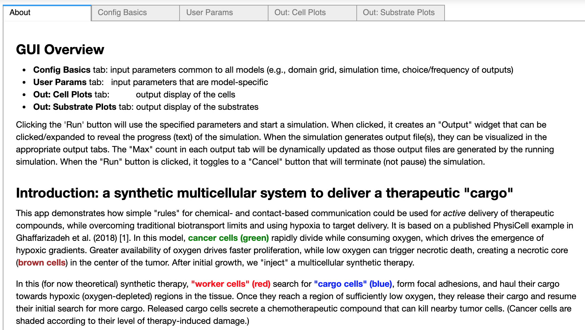
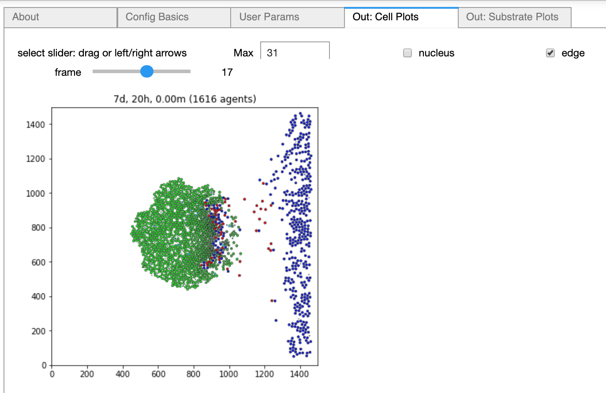

# xml2jupyter

[](https://travis-ci.com/rheiland/xml2jupyter) 

Parse a PhysiCell configuration file (XML) and generate a Jupyter (Python) module (user_params.py)
containing associated widgets for user parameters. For more information, we recommend checking out
[the JOSS paper describing the functionality of this tool](paper/paper.md).

To see an example application that has been generated with xml2jupyter, click the binder badge [](https://mybinder.org/v2/gh/rheiland/xml2jupyter/master?filepath=PhysiCell_GUI%2Fmygui.ipynb)
<!--
(You can also launch an Azure notebook [](https://notebooks.azure.com/randy-heiland/projects/xml2jupyter), but from there, you will need to click on `demo_gui.ipynb`).
-->

<!-- [](https://notebooks.azure.com/import/gh/randy-heiland/xml2jupyter) -->

## Overview

Many scientific simulation packages use text-based configuration files to provide parameter values and run at the command line without a graphical interface. Manually editing these files to explore how different values affect a simulation can be burdensome for technical users, and impossible to use for those with other scientific backgrounds. xml2jupyter is a Python package that addresses these scientific bottlenecks. It provides a mapping between configuration files, formatted in the Extensible Markup Language (XML), and Jupyter widgets.

Using a [PhysiCell](http://physicell.mathcancer.org/) XML configuration file, this tool lets you generate a graphical user interface (GUI) consisting of [Jupyter widgets](https://ipywidgets.readthedocs.io/en/stable/index.html). The `xml2jupyter.py` Python script provides a core component of the GUI by generating a panel (Jupyter `Tab`) of custom model parameter widgets. The other Python scripts in this repository are static; all together, they provide a self-contained Jupyter notebook GUI tailored to a custom PhysiCell simulator. While the project is specific to PhysiCell, the basic idea of generating Jupyter widgets can be extended to other text-based configuration files.

We realize the name "xml2jupyter" is pretty generic. We wanted a name that was descriptive, but also concise and, besides, its functionality can (and most likely will) be extended well beyond what is possible in the initial release - to generate custom parameter widgets for a PhysiCell configuration file.

<!--
If you simply want to try the notebook, without downloading anything, try clicking on this Binder badge [](https://mybinder.org/v2/gh/rheiland/xml2gui/master?filepath=PhysiCell.ipynb) to run it from your browser.
-->

## Installation

Download the `xml2jupyter.py` Python script from this repository. (This will let you perform the core function of generating  Jupyter widgets associated with PhysiCell's `<user_parameters>` in an XML configuration file).

<!--
[](https://mybinder.org/v2/gh/rheiland/xml2gui/master?filepath=PhysiCell.ipynb) Click the binder badge to play with the notebook from your browser without installing anything.
-->

## Dependencies

1. Minimally, this project just requires Python (we recommend Python 3.x). A standard distribution of Python will let you convert sample XML configuration files into Jupyter widgets. 
2. If you install [Jupyter](https://jupyter.org/install), you will be able to display the widgets in a notebook (in your web browser) and modify the XML via the widgets.
3. If you install some additional Python modules (matplotlib and scipy), not available in the standard library, you will be able to display a GUI notebook for PhysiCell. 


We recommend installing the [Anaconda Python 3.x](https://www.anaconda.com/download/) distribution to provide all dependencies. 
However, an alternative, requiring less disk space, is to install [Miniconda Python 3.x](https://conda.io/miniconda.html) and then:
```
conda install matplotlib
conda install scipy
conda install jupyter
```

## Usage

Use this tool by directly running the file `xml2jupyter.py` with Python like so:

```
python xml2jupyter.py <config-files>
```

You can provide several configuration files that will affect the behavior of the
output. Below is an explanation of the possible inputs for this script.

``` 
  Inputs - takes none, 1, 2, 3, or 4 arguments
  ------
    config filename (str, optional): the PhysiCell configuration file (.xml) (Default = config.xml)
    GUI module (str, optional):      the primary GUI for the Jupyter notebook 
    colorname1, colorname2 (str, optional): the colors to use for the alternating rows of widgets 
                                            (Defaults: lightgreen, tan)
  Examples (with 0,1,2,3,4 args):
  --------
    python xml2jupyter.py
    python xml2jupyter.py config_heterogeneity.xml
    python xml2jupyter.py config_heterogeneity.xml mygui.py
    python xml2jupyter.py config_biorobots.xml lightblue tan
    python xml2jupyter.py config_biorobots.xml mygui.py lightblue tan
  
  Outputs
  -------
    user_params.py: Python module used to create/edit custom user parameters (--> "User Params" GUI tab)
```

## Simple example

The  `xml2jupyter.py` script assumes the XML input file has a block element `<user_parameters>` that contains children
elements describing PhysiCell simulation parameters. Each parameter element consists of its name with attributes, defining its data type, units (optional), description (optional), whether the widget should be hidden (optional), and the parameter's default value. The attributes will determine the appearance and behavior of the Jupyter widget. For numeric widgets (the most common type for PhysiCell), xml2jupyter will calculate a delta step size as a function of the default value and this step size will be used by the widget's graphical increment/decrement feature.

To illustrate, consider the following simple XML example, containing each of the four (currently) supported data types (double, int, string, bool) and the various attributes:

```
<PhysiCell_settings>
  <user_parameters>
    <radius type="double" units="micron"
        description="initial tumor radius">250.0
    </radius>
    <threads type="int">8</threads>
    <color type="string" hidden="true">red</color>
    <fix_persistence type="bool">True</fix_persistence>
  </user_parameters>
</PhysiCell_settings>
```

When we map this into Jupyter widgets, we obtain the following rendered results: 
Notice the `color` parameter is not displayed since we specified it should be
hidden in the XML.
The name of the other parameters, their values, and attributes, if present, are displayed 
in rows (as disabled Jupyter button widgets). 
Using alternating row colors ("zebra stripes") helps visually match associated fields 
and avoid changing the wrong parameter value.
For numeric widgets (type "int" or "double"), we compute a delta step value based on the magnitude (log) 
of the initial value.
For example, the `radius` widget will have a step value of 10, whereas `threads` will have a step value of 1.


## PhysiCell configuration example

For a more realistic example, using an actual PhysiCell simulation configuration file provided in this repository, run the following commands in a shell windows (we demonstrate using Unix-style shell commands):
```
$ cp config_samples/config_biorobots.xml .
$ python xml2jupyter.py config_biorobots.xml test_user_params.py 
$ jupyter notebook test_gui.ipynb
```
When the notebook starts in your browser, in the "Cell" menu, click "Run All". This should display the minimal notebook that will let you update your XML after changing values in widgets and cicking the 'Write' button.


<!--
After you have the desired Python modules:
- Copy your project's configuration file (.xml) to this directory, calling it "myconfig.xml"
- Copy your project's executable to this directory, e.g., ```heterogeneity```, in the example below.
- Generate the Python module of widgets for your user params (a "tab" in the Notebook GUI). From a Terminal/Command Prompt window, run:

```python gen_user_tab.py myconfig.xml```

Then run the notebook:

```jupyter notebook PhysiCell.ipynb```

If you don't have your current working directory in your PATH, you will need to be more explicit, e.g.:
```
./heterogeneity myconfig.xml     # on Unix
.\heterogeneity myconfig.xml     # on Windows
```
-->

## PhysiCell simulation GUI

The `PhysiCell_GUI` subdirectory contains Python modules that are responsible for creating and operating the full Jupyter notebook GUI:
```
mygui.py  - top-level module that imports the other modules (that create the "tabs") and populates their content
about.py  - creates the "About" tab with a model's documentation
config.py	- creates the "Config Basics" tab with general simulation parameters
user_params.py - creates the "User Params" tab with a user's custom simulation parameters (this module is generated by xml2jupyter.py)
svg.py    - creates the "Out: Cell Plots" tab to visualize cells (data happens to be in SVG format)
substrates.py  - creates the "Out: Substrate Plots" tab to visualize substrates 
```

The `xml2jupyter.py` script generates a single panel of widgets that represent custom parameters for a PhysiCell simulation. But our ultimate goal is to provide a full-featured GUI for a PhysiCell simulation. By providing additional, static Python modules to accompany the dynamically-generated custom parameters module (from `xml2jupyter.py`), we can achieve this.
To demonstrate, we provide an example GUI for PhysiCell's `cancer biorobots` model, with sample data, in 
this repository. (Note that you won't be able to "Run" an actual simulation though, without additional effort).
From the `PhysiCell_GUI` directory, run the `mygui.ipynb` notebook:
```
$ cd PhysiCell_GUI
$ jupyter notebook mygui.ipynb
```
The notebook should appear in your browser and look like this:


Clicking "Run All" in the "Cell" menu should display the full GUI, with the `About` tab's content displayed:



You can click on the other tabs to see their content, e.g., the `User Params` tab which was generated by `xml2jupyter.py`:


and the `Cell Plots` and `Substrate Plots` which will display pre-computed data when you click the `frame` slider:




The following images show a Jupyter notebook GUI for the same model, with additional substrate plots, running on [nanoHUB](https://nanohub.org/).


This is described more fully in the accompanying paper.

## Contributions

This project, at least in this early stage, targets the needs of the PhysiCell project. The primary script (`xml2jupyter.py`) only parses an XML configuration file with a handful of specific attributes, mostly related to numeric parameters. Therefore, PhysiCell developers and users will most likely provide contributions to this project (although anyone is welcome). We request that such contributions be made either as a [GitHub pull request](https://help.github.com/en/articles/about-pull-requests) or, if users are unfamiliar with GitHub, as a posting to https://groups.google.com/forum/#!forum/physicell-users.
